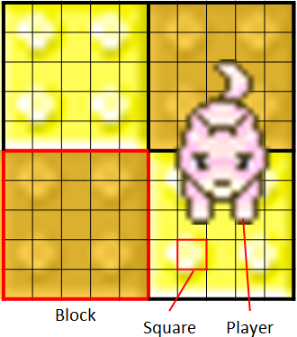

# JavaChallenge2015

## Overview of Game

Drop the block, and drop the enemies!

## Rules

Move on field composed of 64 (8 x 8) blocks, and drop the blocks with your direction.
Players can drop the enemies with the block. The last remaining player is winner.

### Initial Settings

There are four players. Initial position and direction is decided randomly, and players get their each id (0, 1, 2, 3).

### Field

Field is composed of 1600 (40 x 40) squares.
To be exact, there are 64 (8 x 8) blocks on the field, and each block is composed of 25 (5x5) squares.

### Flow of Game

Game starts at player id 0, and continues by turn as ID0->ID1->ID2->ID3->ID0->...

At the beginning of each turn, current information is sent through the standard input.
Players should choose one action from the following.
- Move to the upper/lower/right/left square
- Attack to current direction
- Do nothing

#### Move

Move to the upper/lower/right/left _square_.
Then, direction is changed depending on the move.

#### Cancel of Move

In the following cases, move is canceled but direction is changed.
- Move to the out of field
- Move to the block already dropped
- Move to the square whose Manhattan distance is less than 7 from other player

#### Attack

After your AI take attack command, the neighbor block is going to fall in the next your AI's turn (4 turn after),
the second neighbor block is going to fall in the second next your AI's turn (8 turn after), and so on.
If the enemy drop with the block, the enemy's life decreases.

### Restore the Block

Dropped block restores in the fifth next your AI's turn (20 turns after).

### End of Game

The player who makes other player's life 0 is the winner.

## Input and Output Format of AI Programs

### Output Format for Ready Message

When the AI programs prepared for the game, they must print `READY` to the standard output.
Note that, the ready message must be printed within 5 seconds from game start, otherwise the AI program will be terminated by force.

### Input Format of Game Settings

<pre>
id
T
L0 L1 L2 L3
B0,0 B0,1 B0,2 ... B0,39
B1,0 B1,1 B1,2 ... B1,39
...
B39,0 B39,1 B39,2 ... B39,39
R0 C0
R1 C1
R2 C2
R3 C3
EOD
</pre>

* id: player ID
* T: current turn
* Li: the life of player ID i
* Br,c: status of square (_r_th row, _c_th column) on the field
 * in case of 0, the square is stable and no plan to fall
 * in case of positive number, the square is going to fall that number's turn after
 * in case of negative number, the square is dropped now, and restores that number's absolute value turn after
* EOD: end of input

### Output Format of Actions

Print the one command from the following.
Note that, if an AI program does not print its action within 2 seconds from the beginning of a turn, it will be terminated by force.

 * "U": move to the upper square
 * "R": move to the right square
 * "D": move to the lower square
 * "L": move to the left square
 * "A": attack to current direction
 * "N": do nothing

### Note for Output

Please terminate the output with the newline character ("\n"), and be sure to flush the standard output after printing.
